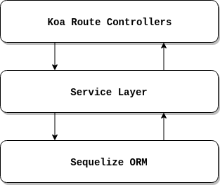

# Koa API Template
REST Api template to be used on personal projects and for learning purposes.

🚀 UNDER CONSTRUCTION 🚀

## Initial Scope
Use principle of separation of concerns to move the business logic away from the API routes.

So, the structure will be like this:

## First things first:

### Why use Koa and not Express?
- Koa is more lightweight, with just 500 lines of code;
- Better error handling through try/catch;
- Cleaner, more readable async code;
- Think like that: when you install Express, you buy a complete and ready to consume pizza,
  when you install Koa, you buy only the dough. So you have to buy all other ingredients
  manually and mix them with the dough yourself. 🍕

## Source Links:
- Express/Koa/Hapi Comparison: https://nodesource.com/blog/Express-Koa-Hapi
