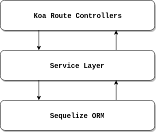

[](https://gitpod.io/#https://github.com/cacaudev/koa-api-template)

# Koa API Template
REST Api template to be used on personal projects and for learning purposes.

🚀 UNDER CONSTRUCTION 🚀

## Guide
Use principle of separation of concerns to move the business logic away from the API routes.

So, the structure will be like this:



### Prerequisites
- NodeJS > 10.0
- PostgreSQL > 10.13
- (Optional) PgAdmin > 4.0 - Only for database management and verify data

### Installation

OBS: Add .env file on the config folder using the keys from the example on the same paste
before running the commands to create and populate database.

- Install Dependencies
```
$ npm install
```
- Create local database
```
$ npm run create:db
```
- Add user table from the migration folder
```
$ npm run migrate:db
```
- Run server locally
```
$ npm run dev
```
- Run tests
```
$ npm run test
```

## First things first

### Why use Koa and not Express?
- Koa is more lightweight, with just 500 lines of code;
- Better error handling through try/catch;
- Cleaner, more readable async code;
- Think like that: when you install Express, you buy a complete and ready to consume pizza,
  when you install Koa, you buy only the dough. So you have to buy all other ingredients
  manually and mix them with the dough yourself. 🍕

## Source Links
- Express/Koa/Hapi Comparison: https://nodesource.com/blog/Express-Koa-Hapi

## Roadmap
- [x] Koa Configuration
- [x] Babel Configuration
- [x] ESLint Configuration
- [x] Sequelize Layer (Db acess and model implementation)
- [x] Middleware Layer examples
- [x] API Validation layer (Joi)
- [x] Service Layer examples
- [x] Logging 'Layer' (Koa-morgan, Winston)
- [x] i18n Support (i18next) for Content Translation
- [x] Response Formatter 'Layer'
- [x] Errors Emitter 'Layer'
- [x] Timezone configuration
- [x] Pagination support
- [ ] Email Service
- [ ] Bcrypt Authorization and Protection
- [ ] JWT Authentication Layer
- [ ] JSDoc/Swagger/ESDoc Documentation
- [ ] Unit tests (Jest and SuperTest)
